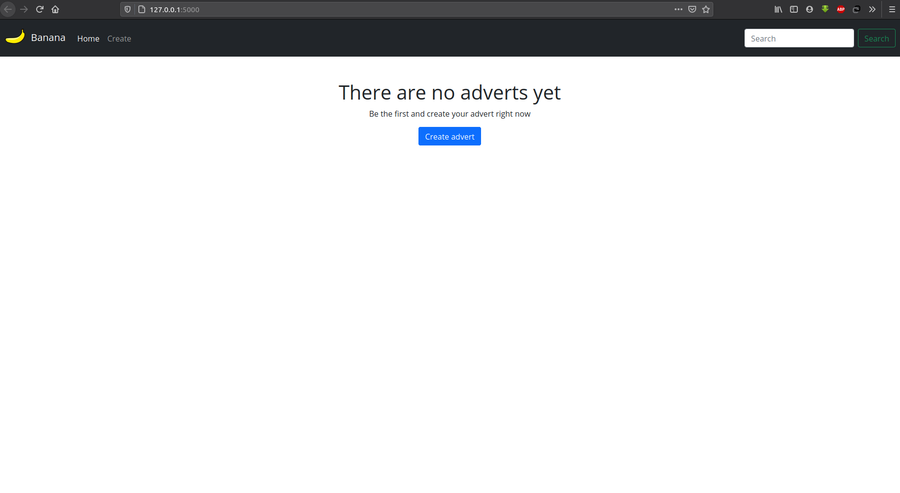
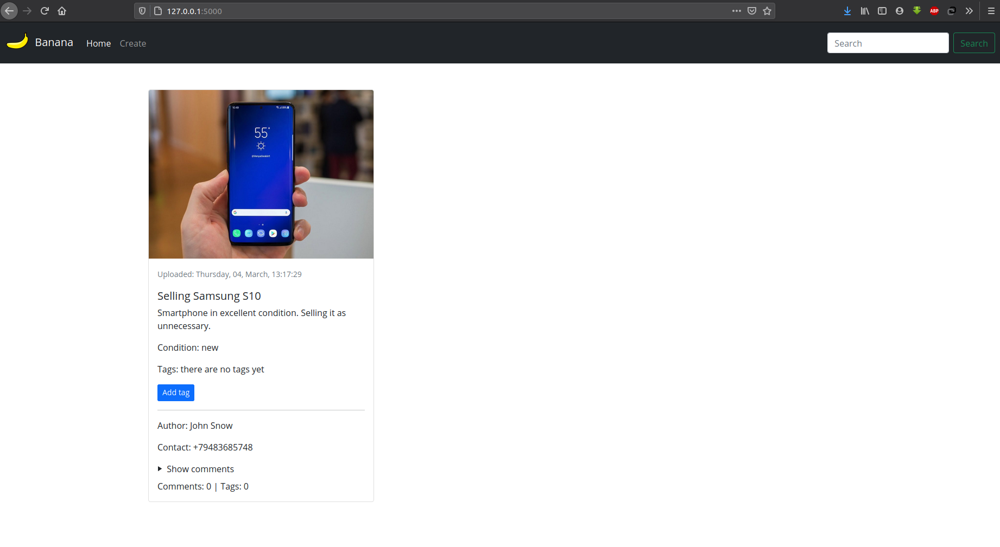
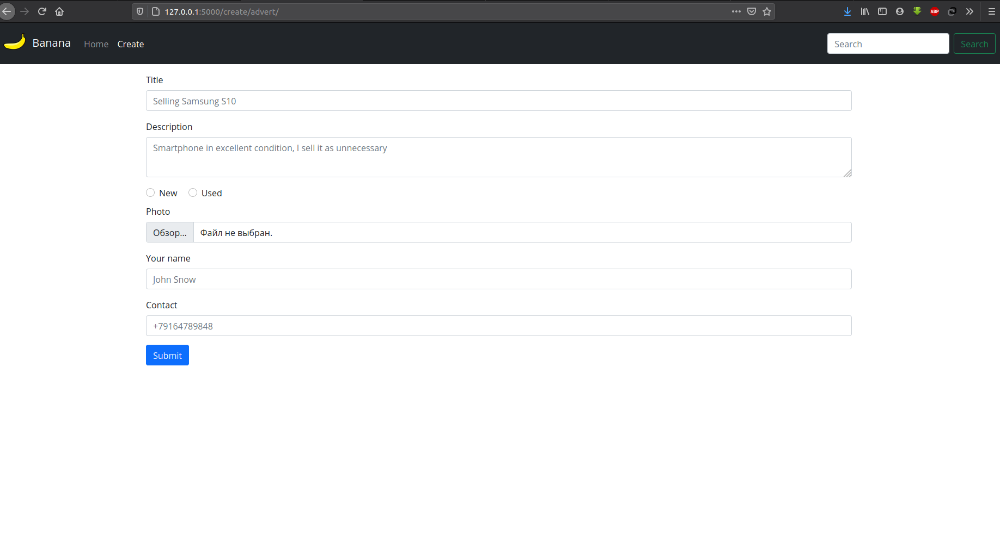
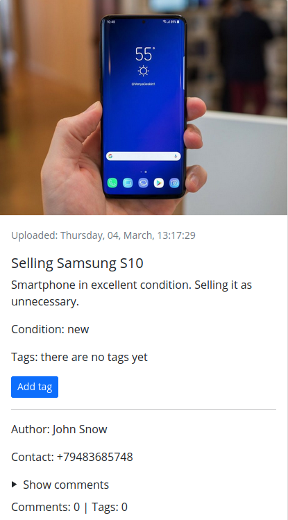
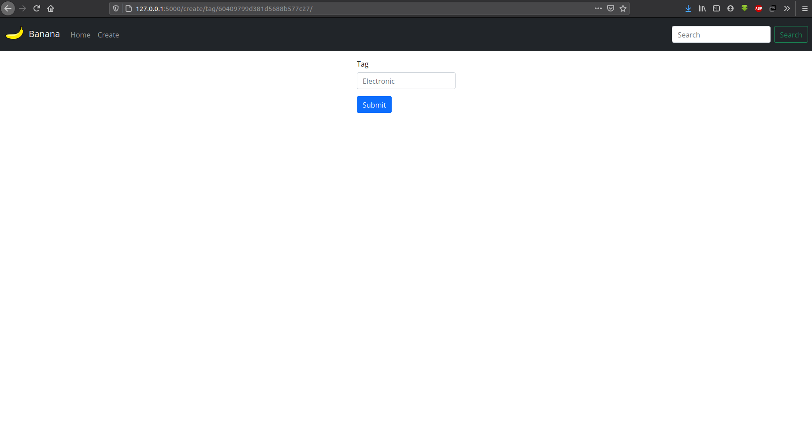
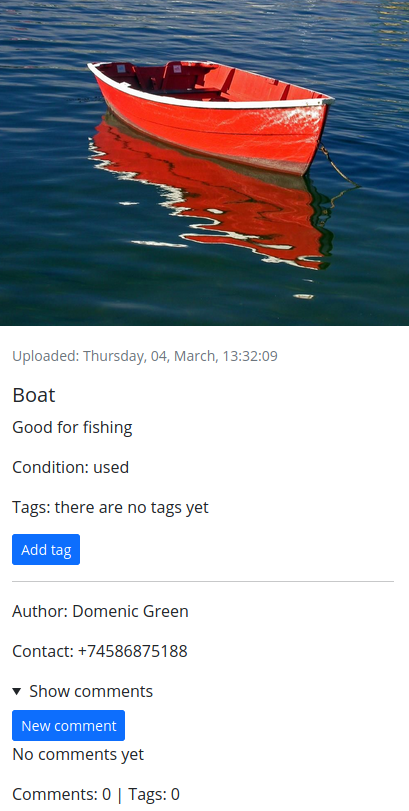
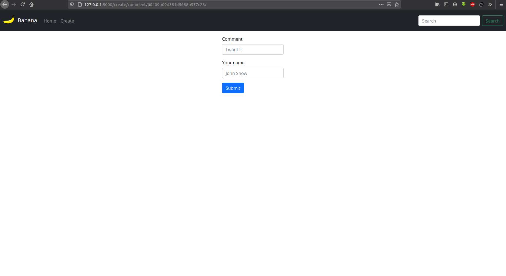
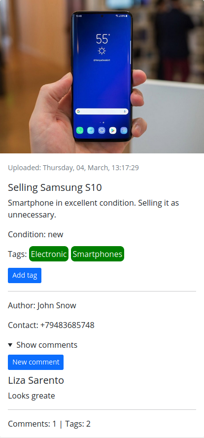

# E7.11
## Приложение - доска объявлений
___
#### Routes:
1. / - главная страница предложения, где выводятся объявления или сообщение о том, что объявлений еще нет:<br>


2, /create/advert/ - форма для создания объявления:<br>

3. /search/<query>. Для поиска конкретного объявления мы може вопспользоваться поисковой формой в навигационном меню приложения:<br>


4. /create/tag/<ObjectID>. Есть возможность добавления тэга к объявлению по нражатию на соответствующую кнопку:<br>


5. /create/comment/<ObjectID>. Есть возможность добавления тэга к объявлению по нражатию на соответствующую кнопку:<br>


6. Статистику количества комментариев и тегов можно увидеть на карточке объявления:<br>

___
#### Развертывание:
```git clone https://github.com/eternityxxxx/E7.11.git```  
```docker-compose --build up```
